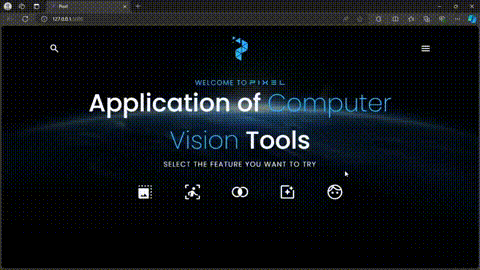
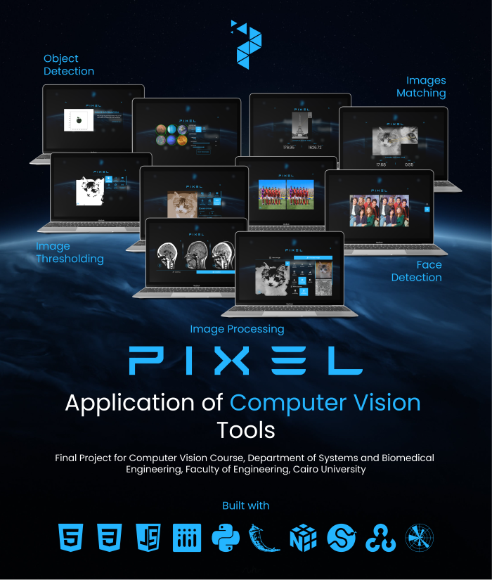

<p align="center"></p>

<h1 align="center">Pixel Computer Vision Final Project</h1>

<p align="center"></p>
<p align="center"></p>

## Overview

This project applies everything we've learned in the Computer Vision course and is designed to be user-friendly. It allows users to interact with and try various tools, such as image processing, object detection, and many others, independently.

## Note

For additional details about the project, [please click here!](https://mahmoud46.github.io/pixel/)

## 👨‍🎓 Project Team

- **[Mahmoud Zakaria](https://github.com/Mahmoud46)** – Junior Biomedical Engineering Student
- **[Yasmin Yasser](https://www.linkedin.com/in/yasmin-yasser-92ba09235/)** – Junior Biomedical Engineering Student

- **[Aisha Waziry](https://www.linkedin.com/in/aisha-waziry-330592212/)** – Junior Biomedical Engineering Student

### Run

```bash
git clone https://github.com/Mahmoud46/Computer-Vision-Final-Project.git
cd Computer-Vision-Final-Project
python run.py
```

## 📄 License & Copyright

© **May 2023 – Pixel Project Team**  
All rights reserved.
